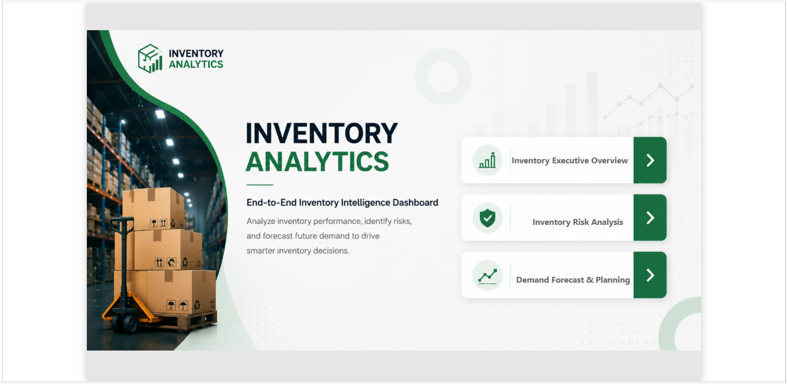
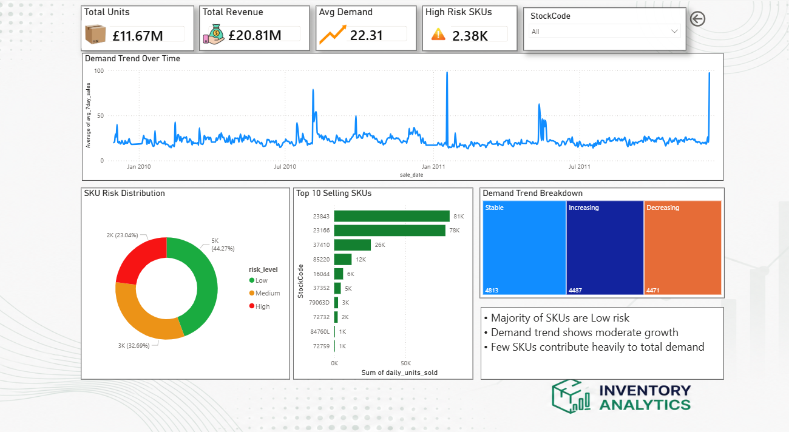
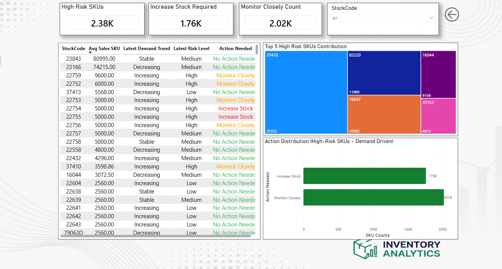
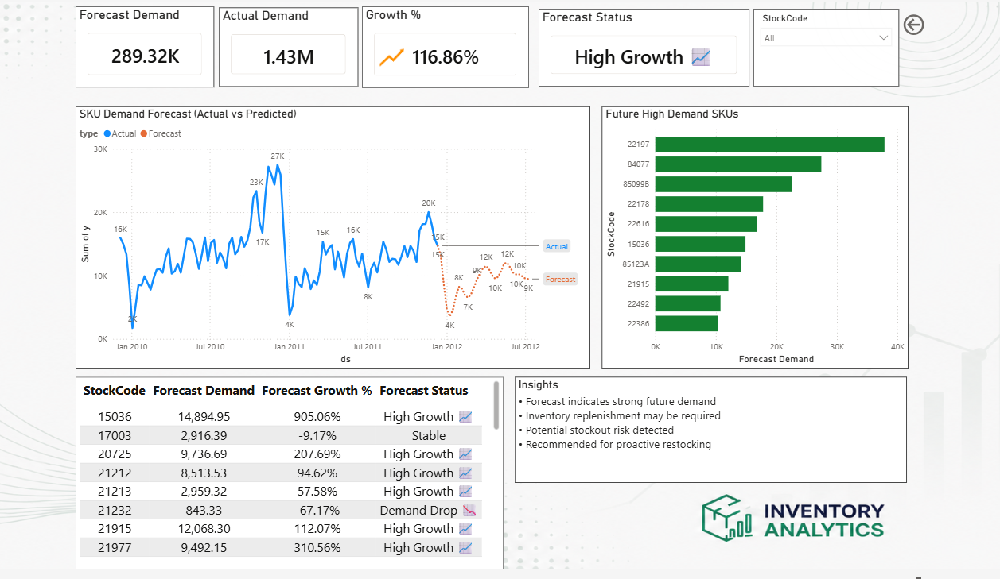

# 📦 Inventory Analytics & Demand Forecasting

End-to-end Inventory Analytics and Demand Forecasting solution built using SQL, Python, Prophet, and Power BI to analyze retail sales behavior, identify inventory risks, and forecast future product demand for smarter inventory planning.

---

# 🚀 Project Overview

Managing inventory efficiently is one of the biggest challenges in retail businesses.

Poor inventory planning can lead to:
- Overstock situations
- Stock shortages
- Revenue loss
- Increased holding costs
- Poor customer satisfaction

This project solves the problem by combining:
- Historical sales analytics
- Inventory risk analysis
- Demand trend monitoring
- Future demand forecasting

into a single interactive Power BI dashboard.

---
# 🖼️ Dashboard Preview

## Inventory Executive Overview


## Inventory Executive Overview


## Inventory Risk Analysis


## Demand Forecasting & Planning


---

# 🎯 Business Objectives

- Analyze historical retail sales performance
- Identify high-risk inventory SKUs
- Detect changing demand patterns
- Forecast future product demand
- Support proactive inventory planning decisions
- Improve stock replenishment strategy

---

# 🛠️ Tech Stack

| Technology | Purpose |
|---|---|
| SQL (BigQuery) | Data transformation & analytics |
| Python | Forecasting pipeline |
| Pandas & NumPy | Data processing |
| Prophet | Time-series demand forecasting |
| Power BI | Interactive dashboarding |
| GitHub | Version control & project hosting |

---

# 📂 Dataset

- Dataset Source: Kaggle Online Retail Dataset
- Retail transaction dataset containing:
  - Invoice data
  - Product SKUs
  - Quantity sold
  - Revenue
  - Transaction dates

---

# 🔄 Project Workflow

## 1️⃣ Data Cleaning & Transformation (SQL)

Performed:
- Null handling
- Revenue calculations
- Daily SKU aggregation
- Rolling demand analysis
- Inventory risk classification
- Demand trend generation

Generated datasets:
- retail_clean
- retail_daily
- retail_with_velocity
- retail_with_trend
- final_inventory_dataset

---

## 2️⃣ Demand Forecasting (Python)

Built forecasting pipeline using Facebook Prophet.

Performed:
- SKU-wise forecasting
- Trend prediction
- Forecast dataset generation
- Future demand estimation

Generated:
- final_forecast_dataset.csv

---

## 3️⃣ Power BI Dashboard Development

Built 3 interactive dashboard pages:

### 📊 Inventory Executive Overview
- KPI monitoring
- Demand trend analysis
- SKU performance tracking
- Risk distribution analysis

### ⚠️ Inventory Risk Analysis
- High-risk SKU identification
- Action recommendation system
- Inventory monitoring insights

### 📈 Demand Forecasting & Planning
- Actual vs forecast comparison
- Forecast growth analysis
- Future high-demand SKU prediction
- Inventory planning insights

---

# 📌 Key Features

✅ End-to-end analytics pipeline  
✅ Dynamic inventory risk classification  
✅ Demand forecasting using Prophet  
✅ Interactive Power BI dashboard  
✅ SKU-level drill-down analysis  
✅ Business-driven KPI monitoring  
✅ Forecast-based inventory planning  

---

# 📈 Key Insights

- Majority of SKUs fall under low-risk inventory category
- Certain SKUs contribute disproportionately to total demand
- High-growth products indicate possible stock shortage risks
- Declining forecast trends indicate potential overstock conditions
- Forecasting improves proactive inventory decision-making

---

# 📁 Project Structure

```bash
inventory-analytics-demand-forecasting/
│
├── data/
├── sql/
├── python/
├── powerbi/
├── dashboard-screenshots/
├── project-report/
├── presentation/
├── requirements.txt
└── README.md


▶️ How to Run
SQL

Run SQL scripts in Google BigQuery to generate transformed datasets.

Python

Install dependencies:

pip install -r requirements.txt

Run forecasting pipeline:

python forecasting_pipeline.py
Power BI

Open:

Inventory_Analytics_Dashboard.pbix
📚 Skills Demonstrated
SQL Analytics
Data Cleaning
Data Transformation
Time-Series Forecasting
Business Intelligence
Power BI Dashboarding
Data Visualization
Inventory Analytics
KPI Design
End-to-End Data Project Development
👨‍💻 Author

Vishwanath Malli

Electronics & Communication Engineer
Data Analytics Enthusiast
Telecom & Analytics Professional

LinkedIn:
https://www.linkedin.com/in/vishwanath-malli-1920951a0
